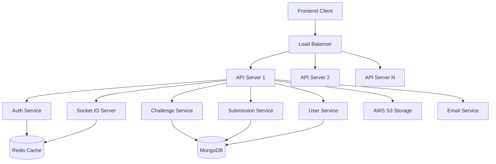

# Design Document

## Overview

The StackRush backend is designed as a RESTful API service built with Node.js, Express.js, and TypeScript. The system follows a layered architecture pattern with clear separation of concerns between routes, controllers, services, and data access layers. The design emphasizes scalability, security, and maintainability while supporting real-time features through Socket.IO integration.

The architecture leverages MongoDB for flexible document storage, Redis for caching and session management, and integrates with frontend-based code execution through WebContainer API. The system is designed to handle high concurrent loads while maintaining data consistency and security.

## Architecture

### System Architecture Overview



### Layer Architecture

1. **Presentation Layer**: Express.js routes and middleware
2. **Business Logic Layer**: Service classes containing core business rules
3. **Data Access Layer**: Repository pattern with Mongoose ODM
4. **Infrastructure Layer**: External services (Redis, MongoDB, S3, Email)

### Technology Stack

- **Runtime**: Node.js 18+ with TypeScript
- **Framework**: Express.js with middleware ecosystem
- **Database**: MongoDB with Mongoose ODM
- **Caching**: Redis for sessions and performance
- **Real-time**: Socket.IO for live updates
- **Authentication**: JWT with refresh token strategy
- **File Storage**: AWS S3 with local fallback
- **Testing**: Jest with Supertest for integration tests
- **Documentation**: Swagger/OpenAPI 3.0

## Components and Interfaces

### Core Services

#### Authentication Service
```typescript
interface IAuthService {
  register(userData: RegisterDto): Promise<UserDocument>;
  login(credentials: LoginDto): Promise<AuthResponse>;
  refreshToken(refreshToken: string): Promise<AuthResponse>;
  forgotPassword(email: string): Promise<void>;
  resetPassword(token: string, newPassword: string): Promise<void>;
  verifyEmail(token: string): Promise<void>;
}
```

#### User Service
```typescript
interface IUserService {
  getUserById(id: string): Promise<UserDocument>;
  updateProfile(id: string, updates: UpdateProfileDto): Promise<UserDocument>;
  getUserStats(id: string): Promise<UserStats>;
  getUserAchievements(id: string): Promise<Achievement[]>;
  updatePreferences(id: string, preferences: UserPreferences): Promise<void>;
  deleteAccount(id: string): Promise<void>;
}
```

#### Challenge Service
```typescript
interface IChallengeService {
  getChallenges(filters: ChallengeFilters): Promise<PaginatedResult<Challenge>>;
  getChallengeById(id: string): Promise<ChallengeDocument>;
  createChallenge(data: CreateChallengeDto): Promise<ChallengeDocument>;
  updateChallenge(id: string, updates: UpdateChallengeDto): Promise<ChallengeDocument>;
  deleteChallenge(id: string): Promise<void>;
  getChallengeStats(id: string): Promise<ChallengeStats>;
  startChallengeSession(userId: string, challengeId: string): Promise<SessionData>;
}
```

#### Submission Service
```typescript
interface ISubmissionService {
  createSubmission(data: CreateSubmissionDto): Promise<SubmissionDocument>;
  processExecutionResults(id: string, results: ExecutionResults): Promise<SubmissionDocument>;
  getSubmissionById(id: string): Promise<SubmissionDocument>;
  getUserSubmissions(userId: string, filters: SubmissionFilters): Promise<PaginatedResult<Submission>>;
  calculateScore(submission: SubmissionDocument, results: ExecutionResults): Promise<number>;
}
```

### Middleware Components

#### Authentication Middleware
```typescript
interface AuthMiddleware {
  authenticate(req: Request, res: Response, next: NextFunction): void;
  authorize(roles: string[]): (req: Request, res: Response, next: NextFunction) => void;
  rateLimitAuth(req: Request, res: Response, next: NextFunction): void;
}
```

#### Validation Middleware
```typescript
interface ValidationMiddleware {
  validateRequest(schema: Joi.Schema): (req: Request, res: Response, next: NextFunction) => void;
  sanitizeInput(req: Request, res: Response, next: NextFunction): void;
}
```

### Repository Interfaces

#### Base Repository
```typescript
interface IBaseRepository<T> {
  create(data: Partial<T>): Promise<T>;
  findById(id: string): Promise<T | null>;
  findOne(filter: FilterQuery<T>): Promise<T | null>;
  find(filter: FilterQuery<T>, options?: QueryOptions): Promise<T[]>;
  update(id: string, updates: Partial<T>): Promise<T | null>;
  delete(id: string): Promise<boolean>;
  count(filter: FilterQuery<T>): Promise<number>;
}
```

## Data Models

### User Model
```typescript
interface IUser {
  _id: ObjectId;
  email: string;
  username: string;
  password: string;
  profile: {
    firstName?: string;
    lastName?: string;
    avatar?: string;
    bio?: string;
    location?: string;
    website?: string;
    github?: string;
    linkedin?: string;
  };
  stats: {
    level: number;
    xp: number;
    totalChallenges: number;
    completedChallenges: number;
    streak: number;
    lastActiveDate: Date;
  };
  preferences: {
    theme: 'light' | 'dark';
    notifications: {
      email: boolean;
      push: boolean;
      achievements: boolean;
      challenges: boolean;
    };
    privacy: {
      profilePublic: boolean;
      showStats: boolean;
      showActivity: boolean;
    };
  };
  roles: ('user' | 'admin' | 'moderator')[];
  isActive: boolean;
  emailVerified: boolean;
  createdAt: Date;
  updatedAt: Date;
}
```

### Challenge Model
```typescript
interface IChallenge {
  _id: ObjectId;
  title: string;
  slug: string;
  description: string;
  type: 'dsa' | 'bug-fix' | 'feature';
  difficulty: 'Easy' | 'Medium' | 'Hard';
  category: string;
  tags: string[];
  timeLimit?: number;
  content: {
    problemStatement: string;
    constraints?: string;
    examples: Array<{
      input: string;
      output: string;
      explanation?: string;
    }>;
    hints: string[];
    solution: string;
    solutionExplanation: string;
  };
  code: {
    starterCode: {
      javascript?: string;
      typescript?: string;
      python?: string;
      java?: string;
      cpp?: string;
    };
    testCases: Array<{
      input: string;
      expectedOutput: string;
      isHidden: boolean;
      weight: number;
    }>;
    validationRules: {
      timeComplexity?: string;
      spaceComplexity?: string;
      forbiddenKeywords: string[];
      requiredKeywords: string[];
    };
  };
  scenario: {
    background?: string;
    role?: string;
    company?: string;
    urgency: 'low' | 'medium' | 'high';
    distractions: Array<{
      type: string;
      frequency: string;
      content: string;
    }>;
  };
  stats: {
    totalAttempts: number;
    successfulAttempts: number;
    averageTime?: number;
    averageScore?: number;
    popularityScore: number;
  };
  author: ObjectId;
  isPublic: boolean;
  isActive: boolean;
  createdAt: Date;
  updatedAt: Date;
}
```

### Submission Model
```typescript
interface ISubmission {
  _id: ObjectId;
  user: ObjectId;
  challenge: ObjectId;
  code: string;
  language: string;
  execution: {
    status: 'pending' | 'completed' | 'failed' | 'timeout';
    score?: number;
    totalTests?: number;
    passedTests?: number;
    executionTime?: number;
    memoryUsage?: number;
    output?: string;
    error?: string;
    testResults: Array<{
      testCase: ObjectId;
      passed: boolean;
      actualOutput?: string;
      executionTime?: number;
      error?: string;
    }>;
    executedInBrowser: boolean;
    browserEnvironment?: string;
  };
  simulation: {
    mode: 'standard' | 'interview' | 'zen';
    distractionLevel: 'low' | 'medium' | 'high';
    timeSpent?: number;
    distractionsEncountered?: number;
    focusScore?: number;
    stressLevel?: number;
  };
  metadata: {
    ipAddress?: string;
    userAgent?: string;
    startedAt: Date;
    submittedAt?: Date;
    isCompleted: boolean;
  };
  createdAt: Date;
  updatedAt: Date;
}
```

## Error Handling

### Error Response Structure
```typescript
interface ApiError {
  success: false;
  error: {
    code: string;
    message: string;
    details?: any;
    timestamp: string;
    path: string;
  };
}
```

### Error Categories
1. **Validation Errors** (400): Invalid input data
2. **Authentication Errors** (401): Invalid or missing credentials
3. **Authorization Errors** (403): Insufficient permissions
4. **Not Found Errors** (404): Resource not found
5. **Conflict Errors** (409): Resource conflicts
6. **Rate Limit Errors** (429): Too many requests
7. **Server Errors** (500): Internal server errors

### Global Error Handler
```typescript
interface ErrorHandler {
  handleValidationError(error: ValidationError): ApiError;
  handleAuthenticationError(error: AuthError): ApiError;
  handleDatabaseError(error: MongoError): ApiError;
  handleUnknownError(error: Error): ApiError;
}
```

## Testing Strategy

### Unit Testing
- **Service Layer**: Test business logic with mocked dependencies
- **Repository Layer**: Test data access with in-memory MongoDB
- **Utility Functions**: Test pure functions with comprehensive cases
- **Middleware**: Test authentication, validation, and error handling

### Integration Testing
- **API Endpoints**: Test complete request/response cycles
- **Database Operations**: Test with test database instances
- **External Services**: Test with mocked external APIs
- **Real-time Features**: Test Socket.IO connections and events

### Performance Testing
- **Load Testing**: Simulate concurrent users and requests
- **Stress Testing**: Test system limits and failure points
- **Database Performance**: Test query optimization and indexing
- **Memory Usage**: Monitor for memory leaks and optimization

### Security Testing
- **Authentication**: Test JWT handling and refresh tokens
- **Authorization**: Test role-based access controls
- **Input Validation**: Test against injection attacks
- **Rate Limiting**: Test API abuse prevention

### Test Structure
```
tests/
├── unit/
│   ├── services/
│   ├── repositories/
│   ├── middleware/
│   └── utils/
├── integration/
│   ├── auth/
│   ├── challenges/
│   ├── submissions/
│   └── users/
├── performance/
│   ├── load-tests/
│   └── stress-tests/
└── fixtures/
    ├── users.json
    ├── challenges.json
    └── submissions.json
```

### Testing Tools and Configuration
- **Jest**: Primary testing framework with TypeScript support
- **Supertest**: HTTP assertion library for API testing
- **MongoDB Memory Server**: In-memory database for testing
- **Redis Mock**: In-memory Redis for testing
- **Socket.IO Client**: For testing real-time features
- **Artillery**: For load and performance testing